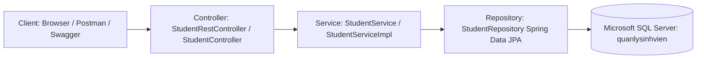

<div align="center">

# 🎓 QUẢN LÝ SINH VIÊN - LAB 03
### Fullstack Spring Boot 3.4 & Microsoft SQL Server

[](https://www.oracle.com/java/)
[](https://spring.io/projects/spring-boot)
[](https://www.microsoft.com/sql-server)
[](http://localhost:8080/swagger-ui/index.html)
[](http://localhost:8080/admin)
[]()

<p align="center">
  <b>Hệ thống Quản lý Sinh viên chuẩn hóa theo yêu cầu LAB 03</b><br>
  Tích hợp đầy đủ RESTful API, Swagger Docs, Giao diện Web HTML và Dashboard AdminLTE 4 hiện đại.
</p>

[⚡ Cài Đặt Nhanh](#-hướng-dẫn-cài-đặt--chạy-dự-án-quick-setup) •
[🏛️ Kiến Trúc Hệ Thống](#%EF%B8%8F-kiến-trúc-hệ-thống) •
[🔌 Danh Sách REST API](#-danh-sách-rest-api-crud-phần-a) •
[💻 Giao Diện Người Dùng](#-giao-diện-người-dùng) •
[🧪 Kiểm Thử Tự Động](#-kiểm-thử-tự-động-automated-tests)

---

</div>

## 🎯 Mục Tiêu & Kết Quả Đạt Được

- [x] **Phần A. Xây dựng REST API chuẩn CRUD & Swagger UI**:
  - Kết nối Spring Boot 3.4 với Microsoft SQL Server 2025.
  - Bảng `students` với khóa chính `id uniqueidentifier` (UUID chuẩn hóa).
  - 5 endpoints CRUD + Tìm kiếm đa trường không phân biệt hoa thường.
  - Tích hợp tài liệu OpenAPI / Swagger UI 3 tương tác trực tiếp.
- [x] **Phần B. Trang Web HTML Quản Lý Sinh Viên**:
  - Giao diện thân thiện, hiển thị danh sách sinh viên trực quan.
  - Hỗ trợ đầy đủ Modal: Thêm mới, Chỉnh sửa, Xem chi tiết và Xác nhận xóa.
- [x] **Phần C. Trang Web Quản Trị Framework AdminLTE 4**:
  - Thiết kế Dashboard chuyên nghiệp với **AdminLTE 4** (Bootstrap 5).
  - Thẻ thống kê (Stat Cards), bộ lọc theo lớp học (`C2024A`, `C2024B`, `C2024C`).
  - Giao tiếp bất đồng bộ qua AJAX / Fetch API (không giật trang), thông báo SweetAlert2.
- [x] **Bảo Mật & Best Practices (The Twelve-Factor App)**:
  - Tách biệt cấu hình mật khẩu sang `.env`, bảo vệ qua `.gitignore`.
  - Cung cấp sẵn `.env.example` và script cơ sở dữ liệu `database.sql`.

---

## 🏛️ Kiến Trúc Hệ Thống

Dự án áp dụng mô hình kiến trúc phân lớp chuẩn của Spring:



### Cấu trúc thư mục dự án

```text
schoolmanager/
├── src/
│   ├── main/
│   │   ├── java/com/example/schoolmanager/
│   │   │   ├── controller/         # StudentRestController (API) & StudentController (Views)
│   │   │   ├── entity/             # Student entity (khớp bảng students SQL Server)
│   │   │   ├── repository/         # StudentRepository (JpaRepository<Student, UUID>)
│   │   │   ├── service/            # StudentService interface & StudentServiceImpl
│   │   │   └── SchoolmanagerApplication.java
│   │   └── resources/
│   │       ├── templates/          # students.html (Phần B) & admin-students.html (Phần C)
│   │       ├── application.properties # Cấu hình Spring Boot nạp từ .env
│   │       └── data.sql            # 10 sinh viên mẫu dự phòng
│   └── test/                       # 11 Unit & Integration tests độc lập
├── .env.example                    # Template biến môi trường
├── .gitignore                      # Chặn commit file .env và file nhị phân
├── database.sql                    # Script tạo DB quanlysinhvien & 10 sinh viên mẫu
├── pom.xml                         # Quản lý thư viện Maven
└── README.md
```

---

## ⚡ Hướng Dẫn Cài Đặt & Chạy Dự Án (Quick Setup)

### Bước 1: Tạo CSDL trong SQL Server
Mở **SQL Server Management Studio (SSMS)** hoặc dùng terminal để chạy tệp [`database.sql`](database.sql):
```bash
sqlcmd -S localhost -U sa -P 123123 -C -i database.sql
```
> Script sẽ tự tạo database `quanlysinhvien`, bảng `students` và nạp sẵn **10 sinh viên mẫu** (`SV001` đến `SV010`) đúng định dạng.

---

### Bước 2: Cấu hình biến môi trường (`.env`)
Tạo file `.env` từ file mẫu `.env.example`:
```bash
# Windows PowerShell:
Copy-Item .env.example .env

# Linux / macOS:
cp .env.example .env
```
Nội dung file `.env` (điều chỉnh thông tin đăng nhập theo máy của bạn nếu cần):
```env
DB_HOST=localhost
DB_PORT=1433
DB_NAME=quanlysinhvien
DB_USERNAME=sa
DB_PASSWORD=123123
SERVER_PORT=8080
```

---

### Bước 3: Khởi chạy ứng dụng
Sử dụng Maven Wrapper đính kèm dự án:
```bash
# Windows:
.\mvnw.cmd spring-boot:run

# Linux / macOS:
./mvnw spring-boot:run
```
Ứng dụng sẽ khởi động tại cổng `8080` và tự động kết nối vào SQL Server.

---

### Bước 4: Trải nghiệm trên trình duyệt

| Phân hệ | Đường dẫn truy cập | Đặc điểm nổi bật |
| :--- | :--- | :--- |
| **Swagger UI** | [http://localhost:8080/swagger-ui/index.html](http://localhost:8080/swagger-ui/index.html) | Tài liệu OpenAPI, test API CRUD trực quan |
| **AdminLTE Dashboard** | [http://localhost:8080/admin](http://localhost:8080/admin) | Quản trị chuyên nghiệp, AJAX CRUD, Stat Cards |
| **Giao diện HTML** | [http://localhost:8080/students](http://localhost:8080/students) | Trang web danh sách sinh viên chuẩn Phần B |
| **REST API JSON** | [http://localhost:8080/api/students](http://localhost:8080/api/students) | Dữ liệu thô JSON kết nối trực tiếp CSDL |

---

## 🔌 Danh Sách REST API CRUD (Phần A)

Mọi API đều có tiền tố: `/api/students`

| STT | Method | Endpoint | Mô tả chức năng |
| :---: | :---: | :--- | :--- |
| 1 | `GET` | `/api/students`<br>`/api/students?keyword=...` | Lấy toàn bộ sinh viên hoặc tìm kiếm đa trường (mã SV, họ tên, email, SĐT) |
| 2 | `GET` | `/api/students/{id}` | Lấy chi tiết thông tin 1 sinh viên theo UUID |
| 3 | `POST` | `/api/students` | Tạo mới sinh viên (Tự động sinh UUID) |
| 4 | `PUT` | `/api/students/{id}` | Cập nhật thông tin sinh viên theo UUID |
| 5 | `DELETE` | `/api/students/{id}` | Xóa vĩnh viễn sinh viên khỏi CSDL theo UUID |

### Ví dụ Request & Response:

#### ➕ Thêm mới sinh viên (`POST /api/students`):
```bash
curl -X POST http://localhost:8080/api/students \
  -H "Content-Type: application/json" \
  -d '{
    "studentCode": "SV011",
    "fullName": "Phan Hoàng Long",
    "email": "long@gmail.com",
    "phone": "0912345678",
    "className": "C2024A"
  }'
```

#### 📥 Response mẫu (`201 Created`):
```json
{
  "id": "c623be80-5a50-4828-98e3-0d322ffb7bc1",
  "studentCode": "SV011",
  "fullName": "Phan Hoàng Long",
  "email": "long@gmail.com",
  "phone": "0912345678",
  "className": "C2024A"
}
```

---

## 💻 Giao Diện Người Dùng

### 1. Giao diện AdminLTE 4 (`/admin`)
- **Bộ thẻ thống kê (Info Boxes)**: Tổng số sinh viên, phân bổ theo từng lớp (`C2024A`, `C2024B`, `C2024C`).
- **Tìm kiếm & Lọc tức thì**: Lọc theo lớp, tìm kiếm từ khóa với cập nhật giao diện AJAX tức thì.
- **Thao tác không giật trang**: Thêm, Sửa, Xóa thông qua modal pop-up và thông báo Toast SweetAlert2 mượt mà.

### 2. Giao diện HTML cơ bản (`/students`)
- Chuẩn giao diện theo yêu cầu Phần B của đề bài Lab.
- Đầy đủ nút tương tác xem chi tiết, chỉnh sửa và xác nhận xóa.

---

## 🧪 Kiểm Thử Tự Động (Automated Tests)

Dự án được trang bị **11 bài kiểm thử tự động** bao phủ từ tầng Service đến tầng Web Controller:

```bash
# Windows
.\mvnw.cmd clean test

# Linux / macOS
./mvnw clean test
```

```text
[INFO] -------------------------------------------------------
[INFO]  T E S T S
[INFO] -------------------------------------------------------
[INFO] Running com.example.schoolmanager.StudentRestControllerTest
[INFO] Tests run: 6, Failures: 0, Errors: 0, Skipped: 0
[INFO] Running com.example.schoolmanager.StudentServiceTest
[INFO] Tests run: 5, Failures: 0, Errors: 0, Skipped: 0
[INFO] 
[INFO] Results:
[INFO] Tests run: 11, Failures: 0, Errors: 0, Skipped: 0
[INFO] ------------------------------------------------------------------------
[INFO] BUILD SUCCESS
[INFO] ------------------------------------------------------------------------
```

---

## 👨‍💻 Thông Tin Dự Án
- **Môn học**: Phát triển ứng dụng Web với Java (Web Java)
- **Bài tập**: LAB 03 - CRUD API Sinh viên dùng Spring Boot & SQL Server
- **Tiêu chuẩn**: Clean Architecture, The Twelve-Factor App Config, RESTful Best Practices.
