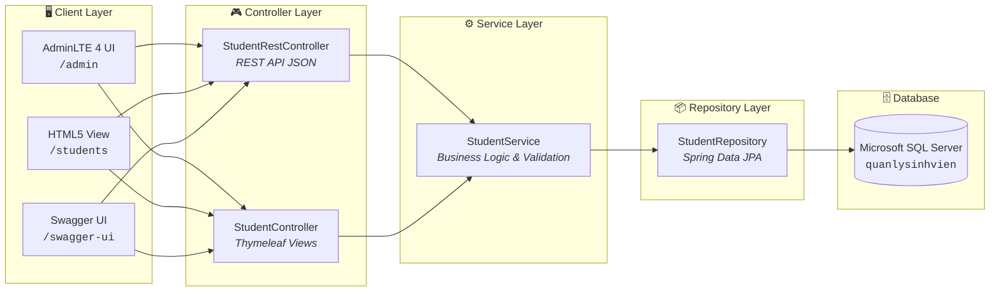

<div align="center">

# 🎓 QUẢN LÝ SINH VIÊN — LAB 03
### Fullstack Spring Boot 3.4 & Microsoft SQL Server

[](https://www.oracle.com/java/)
[](https://spring.io/projects/spring-boot)
[](https://www.microsoft.com/sql-server)
[](http://localhost:8080/swagger-ui/index.html)
[](http://localhost:8080/admin)
[]()

<br/>


<p align="center">
  <b>Hệ thống Quản lý Sinh viên chuẩn hóa theo yêu cầu LAB 03</b><br/>
  <i>Tích hợp đầy đủ RESTful API, Swagger Docs, Giao diện HTML và Dashboard AdminLTE 4 hiện đại.</i>
</p>

[⚡ Cài Đặt Nhanh](#-cài-đặt--khởi-chạy-nhanh-quick-setup) •
[🏛️ Kiến Trúc](#%EF%B8%8F-kiến-trúc-hệ-thống) •
[🔌 REST API](#-danh-sách-rest-api-phần-a) •
[💻 Giao Diện](#-giao-diện-người-dùng) •
[🧪 Kiểm Thử (31 Tests)](#-kiểm-thử-tự-động-toàn-diện-31-tests)

---

</div>

## 🎯 Tổng Quan & Yêu Cầu Đã Hoàn Thành

| Phân hệ | Yêu cầu bài Lab | Trạng thái | Đường dẫn truy cập |
| :--- | :--- | :---: | :--- |
| **Phần A** | 5 REST API CRUD + Kết nối SQL Server + Swagger UI | ✅ Hoàn thành | [`/swagger-ui/index.html`](http://localhost:8080/swagger-ui/index.html) |
| **Phần B** | Trang web HTML `students.html` quản lý sinh viên | ✅ Hoàn thành | [`/students`](http://localhost:8080/students) |
| **Phần C** | Dashboard quản trị sinh viên bằng framework AdminLTE 4 | ✅ Hoàn thành | [`/admin`](http://localhost:8080/admin) |
| **Bảo mật** | Cấu hình `.env`, mã hóa tiếng Việt UTF-8, chặn lộ mật khẩu | ✅ Đạt chuẩn | File `.env` & `.gitignore` |
| **Testing** | 31 bài kiểm thử tự động phủ cả 4 tầng kiến trúc | ✅ 100% Pass | `mvnw test` |

---

## ⚡ Cài Đặt & Khởi Chạy Nhanh (Quick Setup)

Thực hiện đúng 4 bước đơn giản sau để chạy dự án:

### 1️⃣ Bước 1: Khởi tạo CSDL SQL Server
Chạy tệp script [`database.sql`](database.sql) trong **SSMS** hoặc qua terminal:
```bash
sqlcmd -S localhost -U sa -P 123123 -C -i database.sql
```
> [!NOTE]
> Script sẽ tự động tạo database `quanlysinhvien`, bảng `students` (khóa chính `id` kiểu `uniqueidentifier`) và nạp sẵn **10 sinh viên mẫu** chuẩn từ đề bài.

---

### 2️⃣ Bước 2: Thiết lập file môi trường (`.env`)
Copy tệp mẫu `.env.example` thành `.env`:

```bash
# Trên Windows PowerShell:
Copy-Item .env.example .env

# Trên Linux / macOS:
cp .env.example .env
```

Nội dung file [`.env`](.env) (chỉnh lại mật khẩu máy bạn nếu cần):
```env
DB_HOST=localhost
DB_PORT=1433
DB_NAME=quanlysinhvien
DB_USERNAME=sa
DB_PASSWORD=123123
SERVER_PORT=8080
```

---

### 3️⃣ Bước 3: Khởi chạy Spring Boot
Mở terminal tại thư mục dự án và chạy:

```powershell
# Windows:
.\mvnw.cmd spring-boot:run

# Linux / macOS:
./mvnw spring-boot:run
```
> [!TIP]
> Bạn cũng có thể mở file [`SchoolmanagerApplication.java`](src/main/java/com/example/schoolmanager/SchoolmanagerApplication.java) trong VS Code / IntelliJ và bấm nút **Run** (hình tam giác màu xanh).

---

### 4️⃣ Bước 4: Mở trên trình duyệt

```
🌐 Dashboard AdminLTE 4  👉  http://localhost:8080/admin
📖 Swagger OpenAPI UI    👉  http://localhost:8080/swagger-ui/index.html
📄 Giao diện HTML cơ bản 👉  http://localhost:8080/students
🔌 REST API JSON thô     👉  http://localhost:8080/api/students
```

---

## 🏛️ Kiến Trúc Hệ Thống

Dự án áp dụng mô hình kiến trúc phân lớp chuẩn của Spring Boot:



### 📁 Cấu trúc thư mục dự án

```text
schoolmanager/
├── src/main/java/com/example/schoolmanager/
│   ├── controller/             # StudentRestController (API) & StudentController (Views)
│   ├── entity/                 # Student entity (@Table "students", UUID id)
│   ├── repository/             # StudentRepository (JpaRepository<Student, UUID>)
│   ├── service/                # StudentService interface & StudentServiceImpl
│   └── SchoolmanagerApplication.java
├── src/main/resources/
│   ├── templates/              # students.html (Phần B) & admin-students.html (Phần C)
│   ├── application.properties  # Cấu hình Spring Boot tự nạp từ .env
│   └── data.sql                # 10 sinh viên mẫu dự phòng
├── src/test/                   # 31 bài test tự động (Controller, Service, Repository)
├── .env.example                # File mẫu biến môi trường
├── .gitignore                  # Bảo mật, chặn lộ file .env
├── database.sql                # Script tạo CSDL & 10 sinh viên mẫu
├── pom.xml                     # Quản lý dependencies Maven
└── README.md
```

---

## 🔌 Danh Sách REST API (Phần A)

Tất cả API có tiền tố: `http://localhost:8080/api/students`

| Method | Endpoint | Chức năng | Tham số / Body |
| :---: | :--- | :--- | :--- |
| `GET` | `/api/students` | Lấy tất cả sinh viên hoặc tìm kiếm | `?keyword=...` (tùy chọn) |
| `GET` | `/api/students/{id}` | Lấy chi tiết 1 sinh viên | `{id}`: UUID sinh viên |
| `POST` | `/api/students` | Thêm mới sinh viên | Body: JSON thông tin SV |
| `PUT` | `/api/students/{id}` | Cập nhật thông tin sinh viên | Body: JSON thông tin mới |
| `DELETE` | `/api/students/{id}` | Xóa sinh viên khỏi CSDL | `{id}`: UUID cần xóa |

<details>
<summary><b>🔍 Bấm vào đây để xem ví dụ cURL & JSON chi tiết</b></summary>

#### Thêm mới sinh viên (`POST /api/students`):
```bash
curl -X POST http://localhost:8080/api/students \
  -H "Content-Type: application/json" \
  -d '{
    "studentCode": "SV011",
    "fullName": "Phan Hoàng Long",
    "email": "long@gmail.com",
    "phone": "0912345678",
    "className": "C2024A"
  }'
```

#### Response mẫu (`201 Created`):
```json
{
  "id": "c623be80-5a50-4828-98e3-0d322ffb7bc1",
  "studentCode": "SV011",
  "fullName": "Phan Hoàng Long",
  "email": "long@gmail.com",
  "phone": "0912345678",
  "className": "C2024A"
}
```
</details>

---

## 💻 Giao Diện Người Dùng

### 1. Dashboard Quản Trị AdminLTE 4 ([`/admin`](http://localhost:8080/admin))
* **Giao diện hiện đại:** Chuẩn thiết kế AdminLTE v4 trên nền Bootstrap 5.
* **Thống kê tổng quan:** Thẻ Info-box đếm số lượng sinh viên theo từng lớp học (`C2024A`, `C2024B`, `C2024C`).
* **Trải nghiệm mượt mà:** Thêm / Sửa / Xóa bằng Modal và Fetch API bất đồng bộ (không reload trang).
* **Thông báo chuyên nghiệp:** Tích hợp SweetAlert2 Toast.

### 2. Giao Diện HTML Cơ Bản ([`/students`](http://localhost:8080/students))
* Đáp ứng đầy đủ yêu cầu `students.html` ở Phần B của đề bài.
* Tìm kiếm từ khóa tức thì, bảng dữ liệu phân hàng trực quan, hỗ trợ modal Xem và Sửa.

---

## 🧪 Kiểm Thử Tự Động Toàn Diện (31 Tests)

Dự án được trang bị **31 bài kiểm thử tự động chuyên sâu** bao phủ toàn bộ 4 tầng kiến trúc:

```powershell
.\mvnw.cmd test
```

```text
[INFO] -------------------------------------------------------
[INFO]  T E S T S
[INFO] -------------------------------------------------------
[INFO] Running com.example.schoolmanager.StudentRestControllerTest
[INFO] Tests run: 6, Failures: 0, Errors: 0, Skipped: 0 (Tầng REST API)
[INFO] Running com.example.schoolmanager.StudentControllerTest
[INFO] Tests run: 7, Failures: 0, Errors: 0, Skipped: 0 (Tầng Giao diện HTML & AdminLTE)
[INFO] Running com.example.schoolmanager.StudentRepositoryTest
[INFO] Tests run: 5, Failures: 0, Errors: 0, Skipped: 0 (Tầng CSDL & Truy vấn JPA)
[INFO] Running com.example.schoolmanager.StudentServiceTest
[INFO] Tests run: 13, Failures: 0, Errors: 0, Skipped: 0 (Tầng Nghiệp vụ & Edge Cases)
[INFO] 
[INFO] Results:
[INFO] Tests run: 31, Failures: 0, Errors: 0, Skipped: 0
[INFO] ------------------------------------------------------------------------
[INFO] BUILD SUCCESS
[INFO] Total time:  8.740 s
[INFO] ------------------------------------------------------------------------
```

---

<div align="center">

**Web Java — LAB 03: CRUD API Sinh Viên Dùng Spring Boot & SQL Server**<br/>
*Clean Architecture • Twelve-Factor App • RESTful Standards*

</div>
